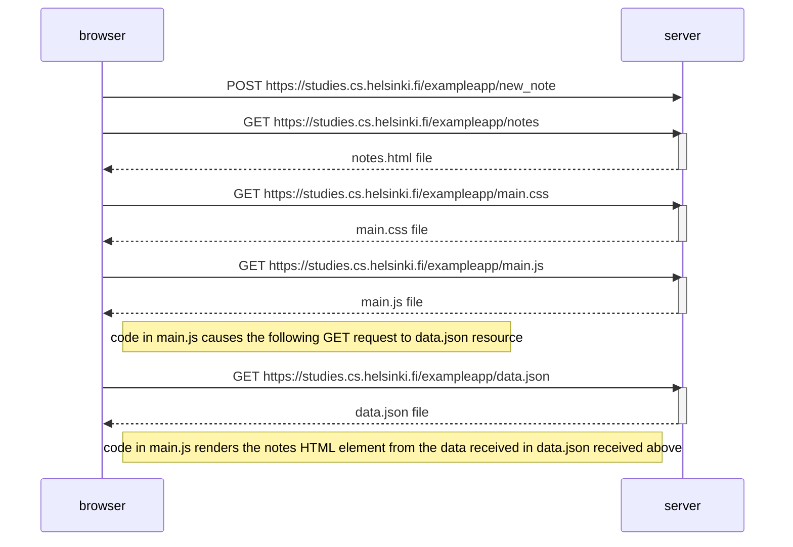

NB: I istalled VSCode extension [Markdown Preview Mermaid Support](https://marketplace.visualstudio.com/items?itemName=bierner.markdown-mermaid) to view mermaid diagram in previews.

The following diagram shows user creating a new note on [https://studies.cs.helsinki.fi/exampleapp/notes](https://studies.cs.helsinki.fi/exampleapp/notes):

