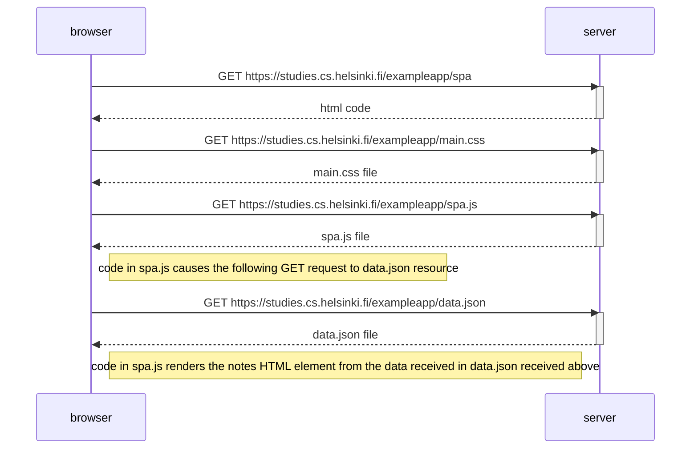

The following diagram shows the user visiting the single page app at [https://studies.cs.helsinki.fi/exampleapp/spa](https://studies.cs.helsinki.fi/exampleapp/spa):

```mermaid
sequenceDiagram
    participant browser
    participant server

    browser->>server: GET https://studies.cs.helsinki.fi/exampleapp/spa
    activate server
    server-->>browser: html code
    deactivate server

    browser->>server: GET https://studies.cs.helsinki.fi/exampleapp/main.css
    activate server
    server-->>browser: main.css file
    deactivate server

    browser->>server: GET https://studies.cs.helsinki.fi/exampleapp/spa.js
    activate server
    server-->>browser: spa.js file
    deactivate server

    Note right of browser: code in spa.js causes the following GET request to data.json resource

    browser->>server: GET https://studies.cs.helsinki.fi/exampleapp/data.json
    activate server
    server-->>browser: data.json file
    deactivate server

    Note right of browser: code in spa.js renders the notes HTML element from the data received in data.json received above
```