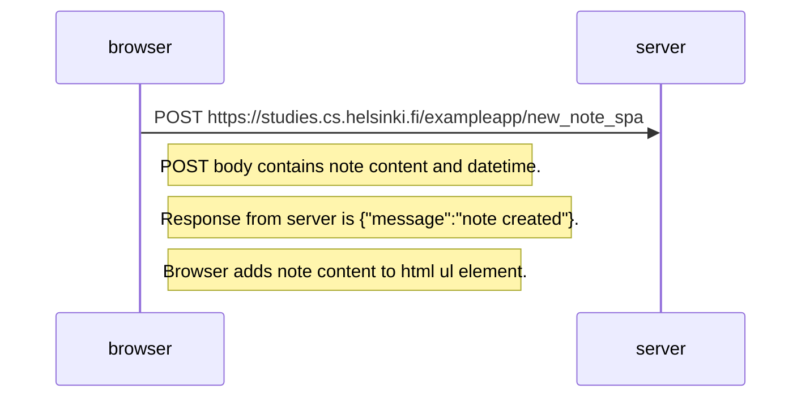

The following diagram shows the user creating a new note in the single page app at [https://studies.cs.helsinki.fi/exampleapp/spa](https://studies.cs.helsinki.fi/exampleapp/spa):

```mermaid
sequenceDiagram
    participant browser
    participant server

    browser->>server: POST https://studies.cs.helsinki.fi/exampleapp/new_note_spa
    Note right of browser: POST body contains note content and datetime. 
    Note right of browser: Response from server is {"message":"note created"}. 
    Note right of browser: Browser adds note content to html ul element.
```