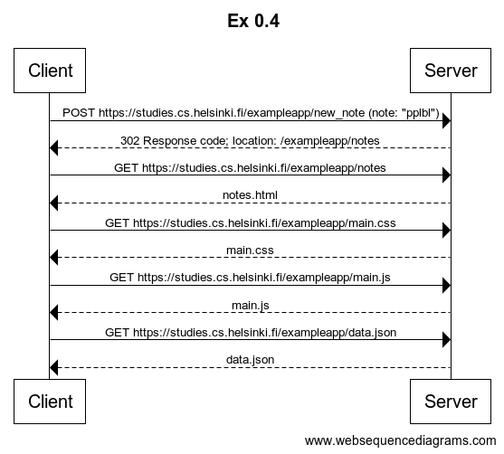

https://www.websequencediagrams.com/
    title Ex 0.4

    Client->Server: POST https://studies.cs.helsinki.fi/exampleapp/new_note (note: "pplbl")
    Server-->Client: 302 Response code; location: /exampleapp/notes
    Client->Server: GET https://studies.cs.helsinki.fi/exampleapp/notes
    Server-->Client: notes.html
    Client->Server: GET https://studies.cs.helsinki.fi/exampleapp/main.css
    Server-->Client: main.css
    Client->Server: GET https://studies.cs.helsinki.fi/exampleapp/main.js
    Server-->Client: main.js
    Client->Server: GET https://studies.cs.helsinki.fi/exampleapp/data.json
    Server-->Client: data.json

